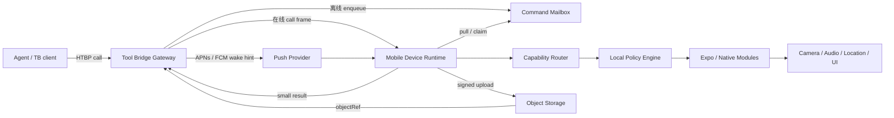
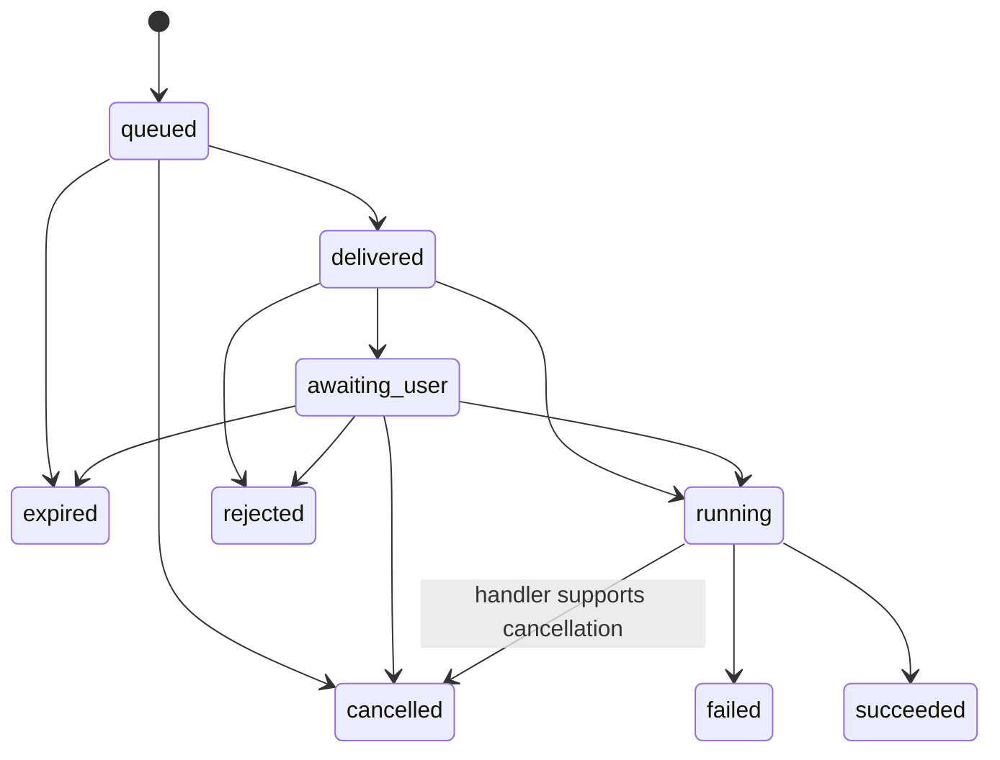

# 系统架构

状态：目标架构。标注“当前”的部分来自现有 Tool Bridge device 契约；标注“新增”的部分需要上游实现。

## 1. 组件



### Mobile App

负责用户界面、配对、权限、控制模式、审计和生命周期编排。

### Device Runtime

负责：

- 稳定设备身份；
- capability probe 和 hello/profile；
- WebSocket / command mailbox transport；
- 调用幂等、取消、过期和结果上报；
- 把协议调用分发到本地 capability handler。

### Local Policy Engine

在每次执行前裁决：

- 凭证绑定的网关和设备是否匹配；
- 工具是否存在且当前可用；
- 控制模式是否允许；
- 是否需要用户确认；
- App 前后台、锁屏、网络和系统权限是否满足；
- 是否超出速率、时长或数据大小限制。

网关允许调用只是必要条件；本地策略是最终执行条件。

### Native Capability Modules

封装 Android / iOS 的相机、音频、通知、位置、深链、后台任务等系统 API。共有语义通过
TypeScript interface 暴露；平台差异保留为结构化 availability 和 reason。

## 2. 仓库之间的责任

| 责任 | 仓库 |
| --- | --- |
| HTBP 基础语义、能力 profile 标准 | `TokenRollAI/HTBP` |
| 网关 device session、pairing、mailbox、push、object upload | `TokenRollAI/tool-bridge` |
| 公共跨运行时 device client | `TokenRollAI/tool-bridge` 发布的 SDK 包 |
| App、策略、原生能力、设备 UI | `TokenRollAI/tool-bridge-mobile` |
| 浏览器扩展运行时 | `TokenRollAI/tool-bridge-browser` |

移动仓库可以提供协议 fixture 和 fake gateway，但不得分叉维护另一套 device wire schema。

## 3. 设备身份与配对

### 3.1 标识

- `installationId`：App 首次安装生成，仅用于本地数据命名；
- `deviceId`：网关认可的稳定、不可猜测设备标识，重装后可变化；
- `displayName`：用户可修改，不参与鉴权；
- `keyId`：设备凭证标识，可轮换和撤销；
- 平台硬件序列号不进入协议。

### 3.2 配对流程（新增）

1. 已登录的管理端向网关创建短期 `pairingSession`；
2. 网关返回二维码/短码，内容仅包含网关 origin、一次性 session id 和抗篡改信息；
3. App 显示目标域名与权限摘要，用户确认；
4. App 生成设备密钥或安全随机挑战材料；
5. App 通过 HTTPS 消费 session；
6. 网关签发绑定 `deviceId + mountPath + audience` 的设备凭证；
7. App 将凭证保存到 Keychain / Android Keystore-backed storage；
8. 首次连接完成后 session 失效。

配对票据必须单次使用、短期过期，且不能本身成为长期设备 SK。

## 4. 连接与可达性

### 4.1 前台在线（当前协议可覆盖）

当前网关端点：

```text
wss://<gateway>/system/device/ws?deviceId=<deviceId>
```

当前流程：

1. 设备建立带认证的 WebSocket；
2. 设备发送 `hello`，包含 `deviceId`、可选 `mountPath` 和 `expose`；
3. 网关回复 `ready`；
4. 网关发送 `call`；
5. 设备以同一 id 返回 `result`；
6. 双方使用精确 JSON `{"type":"ping"}` / `{"type":"pong"}` 心跳。

当前协议适合前台实时调用，但还有两个移动端问题：

- React Native WebSocket 不能像 Node `ws` 一样在握手时自由注入 Authorization header；
- App 进入后台后，操作系统可能暂停或终止连接。

因此上游应提供短期 WebSocket ticket 或正式支持的子协议认证，避免把长期 SK 放进 URL。

### 4.2 后台可达（新增）

后台模型不是“维持永久 WebSocket”，而是 push + mailbox：

1. Agent 调用到达网关；
2. 网关判断设备没有实时 session；
3. 可排队工具生成持久化 command，写入 mailbox；
4. 网关发送不包含敏感参数的 APNs / FCM wake hint；
5. 系统允许时，App 醒来后用设备凭证拉取 command；
6. App claim 命令，校验过期和本地策略；
7. 低风险能力执行；需要 UI 的能力转为可见通知/等待用户；
8. App 回报状态与结果；
9. 调用方轮询或订阅最终状态。

push payload 只包含：

- opaque `commandId`；
- mailbox 版本/提示；
- 非敏感路由提示。

工具参数、位置、媒体地址和凭证不能进入 push payload。

### 4.3 可达性词表

| 状态 | 含义 |
| --- | --- |
| `online` | WebSocket ready，可低延迟调用 |
| `background_reachable` | 有有效 push token，但送达不保证 |
| `offline` | 无实时连接，push 也不可用或近期持续失败 |
| `disabled` | 用户本地关闭远程能力 |
| `revoked` | 网关或本地已撤销凭证 |

`background_reachable` 不能在 UI 或 API 中简称为 online。

## 5. 命令数据模型（新增）

```ts
type DeviceCommand = {
  commandId: string
  deviceId: string
  path: string
  tool: string
  arguments: Record<string, unknown>
  caller: {
    subjectId: string
    displayName?: string
  }
  createdAt: string
  expiresAt: string
  effect: 'read' | 'write' | 'destructive'
  confirmation: 'never' | 'when_locked' | 'always'
  idempotencyKey: string
}
```

状态与转换：



### 幂等

- `commandId` 是设备侧去重主键；
- 客户端在本地持久化终态及安全摘要；
- 重复投递返回首次终态，不再次执行；
- 先持久化“已领取/将执行”，再开始外部副作用；
- crash recovery 必须区分“未执行”“正在执行但结果未知”“已完成”；
- 对无法事务化的副作用，handler 使用自己的 session id 做二级去重。

## 6. 能力注册和动态变化

### 6.1 当前 hello

当前 `DeviceExpose` 支持：

- `nodes`：移动端应只使用这一项；
- `shell`、`fs`：通用设备协议支持，但移动 App 永不暴露；
- 每个 node 的 `cmds` 提供工具描述、schema、effect、confirm。

### 6.2 目标 capability profile

能力不是安装后固定不变。运行时至少在以下事件后重新探测并上报：

- 系统权限变化；
- App 前后台切换；
- 用户切换控制模式；
- 网络/电源状态影响能力；
- 原生模块加载失败；
- App 或 profile 版本更新。

网关应记录 `profileVersion` 和 `observedAt`。执行前设备仍需二次检查，避免“目录显示可用，
实际权限刚被撤销”的竞态。

## 7. 本地模块边界

```ts
interface MobileCapability {
  describe(context: CapabilityContext): CapabilityDescriptor
  execute(
    command: AuthorizedCommand,
    signal: AbortSignal,
  ): Promise<CapabilityResult>
}
```

每个模块必须独立拥有：

- schema 与边界校验；
- capability probe；
- 权限请求和状态读取；
- 本地确认策略；
- 执行、超时与取消；
- 结果清理；
- 可注入的测试适配器。

协议层不能直接 import 相机或音频库；native module 也不能自行持有网关 SK。

## 8. 大对象与实时媒体

### 8.1 小结果

状态、坐标、计时器 id 等小 JSON 直接放 `result.value`。

### 8.2 对象引用（新增上游能力）

照片、音频和视频采用三段式：

1. 设备向网关请求限定 MIME、大小和 TTL 的上传授权；
2. 设备直接上传对象存储并提交 sha256；
3. command result 返回 `objectRef` 和元数据。

上传授权必须绑定：

- deviceId；
- commandId；
- content type；
- 最大字节数；
- 过期时间；
- 单次上传。

Agent 读取对象仍需通过 Tool Bridge 权限检查，不能把公开 bucket URL 当对象引用。

### 8.3 实时流（P2）

实时视频/音频使用 WebRTC；HTBP 只负责建立会话、权限协商和返回状态。媒体本身不通过
WebSocket JSON 帧或网关普通 request body 转发。

## 9. 数据存储

| 数据 | 存储 | 说明 |
| --- | --- | --- |
| 设备凭证/私钥 | SecureStore / Keychain / Keystore | 禁止降级到 AsyncStorage |
| 用户偏好与控制模式 | SQLite | 非敏感但需事务 |
| command inbox 与终态 | SQLite | 支持 crash recovery 和幂等 |
| 本地审计摘要 | SQLite | 有界保留，可由用户清除 |
| 待上传媒体 | App 私有文件目录 | 加密/保护级别按平台配置，有限 TTL |
| capability cache | 内存 + SQLite 摘要 | 事件触发重算 |

push token 虽不是用户密码，也应按敏感标识处理，不进入分析事件和普通日志。

## 10. 错误语义

移动端至少区分：

| code | 场景 | retryable |
| --- | --- | --- |
| `permission_denied` | 用户/系统拒绝权限 | false，除非用户改设置 |
| `confirmation_required` | 等待用户交互 | false（转异步状态） |
| `foreground_required` | 必须打开 App | true |
| `device_locked` | 锁屏阻止能力 | true |
| `unavailable` | 平台或硬件不支持 | false |
| `offline` | 无法投递 | true |
| `expired` | 命令 TTL 到期 | false |
| `cancelled` | 调用方或用户取消 | false |
| `rate_limited` | 超出调用限制 | true |
| `invalid_argument` | schema/策略校验失败 | false |

最终 code 必须与 HTBP / Tool Bridge 统一词表对齐；上表是产品所需语义，不代表当前包已经导出
所有枚举。

## 11. 关键不变量

1. 未通过本地策略的命令永不进入原生 handler。
2. 同一 commandId 最多一次副作用。
3. 敏感能力执行时用户可见。
4. 长期凭证不进入 URL、push、日志或 JS 可导出的调试状态。
5. 媒体字节不进入普通 call/result JSON。
6. 设备断网不会把 queued 当 succeeded。
7. 平台不支持不会被包装成成功。
