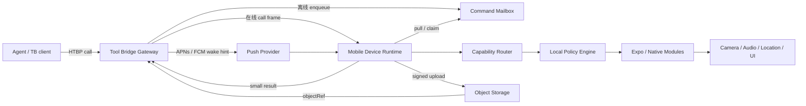
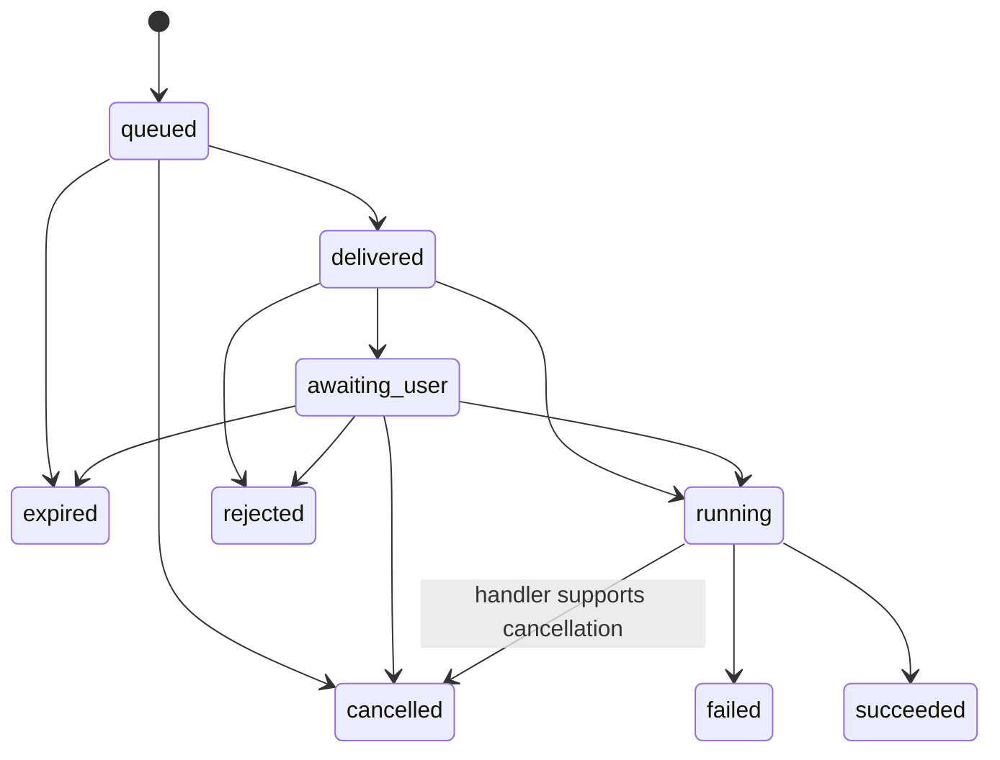

# 系统架构

状态：目标架构 + P0 本地实现事实。标注“上游当前”的部分来自现有 Tool Bridge device 契约；
标注“新增”的部分需要上游实现。

## 0. 当前实现边界

本仓库当前已有、不依赖网关的本地纵向切片：

```text
Expo Router UI
  -> SecureStore installationId / SQLite controlMode
  -> probe-driven phone/status registry
  -> @tool-bridge/sdk/device foreground transport
  -> schema -> expiry/cancel -> admission -> probe -> policy -> persistent claim
  -> claim 后复检 -> handler -> bounded outcome -> redacted audit metadata
```

具体事实：

- `installationId` 由 SecureStore 保存，只是本地安装标识；手工 API key 内测模式的 SDK `deviceId`
  默认由设备硬件标识（Android ID / iOS IDFV）经单向摘要派生为稳定短 ID（硬件标识不可用时回退
  `installationId` 派生），也可由用户自定义，明确不冒充网关签发身份；设备声明挂载到
  `device/phone/<deviceId>`，本地 capability 仍以 `phone/*` 为规范命名空间，在 wire 边界双向转换；
- SQLite schema version 2 保存 control mode、command intent/终态、审计元数据与非敏感 timer 状态；
- opaque device credential envelope 只由 SecureStore facade 保存，不进入 SQLite；本地撤销协调器先
  复用 runtime emergency disable，再以有界超时停止 realtime/mailbox adapter，最终清除凭证；
- `phone/status.get` 从 Expo Battery/Network 与 AppState probe 读取；不可读取字段返回结构化
  `unavailable`，不会填造数据；
- registry 隔离单项 native probe 异常并降级为 `unavailable: probe_failed`，不会让一个原生模块故障
  拖垮整个 capability snapshot 或绕过执行器的稳定结果边界；
- `LocalCommandExecutor` 对同一 `commandId` 持久化去重，在 handler 前执行 schema、过期、取消、
  caller/global admission、probe 与 policy；SQLite claim 返回后再次检查取消/到期，再把含 command
  deadline 的只读 invocation context 交给 handler；crash 后运行中命令变为 `result_unknown`，不会
  自动重放副作用；
- 每个本地 descriptor 声明 rate 和 inline result bytes；admission 在 confirmation 前运行，JSON 结果
  超限返回 `result_too_large` 且大值不进入 SQLite。它是本地边界，不冒充上游 profile/quota；
- command envelope 和持久化 outcome 都做 runtime schema 校验；每次 command 终态写入都在同一 SQLite
  transaction 内把终态总数裁剪至 10,000 条，同时保留 running、当前刚完成的 command 和活动 timer
  source；每次审计 insert 也在同一事务内把元数据裁剪至 5,000 条，两项硬上限都不依赖下一次 App
  启动；
- 首页、能力页和活动页读取同一本地运行时；活动页投影最近 100 条 caller/path/tool/effect/risk/decision/
  outcome 元数据，并提供只删除 `audit_records` 的本地二次确认入口。刷新 revision 防止清除后的旧异步
  snapshot 回写；command 去重、timer、设置、identity 和 credential 不在清除范围；
- 共用 `Screen`/`StatusCard`/`StatusRow`/`AccessibleAction` 统一页面与卡片 header、label/value 关联、
  48dp 操作区和 disabled/busy 语义；tab focus 与 destructive confirmation 通过受控 helper 移动，离散
  状态公告按 semantic key 去重，倒计时、媒体进度和敏感确认正文不进入自动公告；
- emergency disable 会取消进行中 handler、拒绝 pending confirmation、停止 attention/media/timer、
  suspend SDK realtime，并使后续命令在 handler 前拒绝；
- `@tool-bridge/sdk/device@0.11.0` 已接入前台 realtime：SecureStore 动态取 credential、RN WebSocket
  header、官方 hello/ready/call/result、心跳、cancel 与 AppState suspend/resume 均进入生产 wiring；
  registry 只投影 SDK 正式字段，没有私自定义 frame；
- 首页已提供手工 Gateway HTTPS origin + API key 内测入口。保存严格执行“停止旧 transport -> 写
  SecureStore -> 连接新 audience”；清除严格执行“停止 -> 删除 API key -> 恢复可选构建 URL”，失败时
  保持连接关闭。当前仍没有正式 pairing、短期 ticket、mailbox 或 push；只有 ready 为 `online`。

本地 contract test 使用注入的 fake dispatcher/probe 验证安全顺序；SDK transport contract 另以官方
encode/decode 和 fake WebSocket 验证 consumer wiring。两者都不等同于真实 gateway compatibility matrix
或端到端设备证据。

无障碍 helper 只使用 React Native core API，不新增原生权限或依赖。component test 与 Android
UIAutomator 语义树可以验证名称、state、最小操作尺寸和 200% 字号下仍可滚动/点击，但不能验证
TalkBack/VoiceOver 实际朗读、手势顺序、Switch Access 或 iOS Dynamic Type；这些继续由平台矩阵验收。

当前本地能力还包括 `phone/media`：受控 resolver 在创建 player 前逐跳校验 HTTPS hostname 与最终
URL，以 MIME header + 文件签名、声明/实际 25 MiB 上限约束内容，再把 App 私有 `file://` cache URI
交给 `expo-audio`；原生 port 在 `play()` 前以 10 秒 metadata timeout 拒绝直播、无效时长和超过 2
小时的媒体。单 player controller 投影 loading/playing/paused/interrupted/stopped/failed；会话
只保留 hostname/MIME/大小等元数据，普通审计不保存完整 URL/query 或私有路径。Android/iOS 已生成
系统可见媒体控制配置，但真机锁屏、后台和音频中断行为仍属于未完成证据。

`phone/location.current` 使用 `expo-location` foreground API：实际服务/权限 probe 决定
available、permission_required 或 unavailable；high-risk 本地确认完成前不请求权限。adapter 只建立
一次性可取消订阅，首个 fix 后立即移除，并把采集时间、水平精度与 precise/approximate 状态返回给
调用方。实际等待取入参 timeout 与 command deadline 剩余时间的较小值。Android/iOS 原生配置显式
禁止后台位置；普通审计不保存坐标。

`phone/location.open_map` 是独立 handoff，不读取当前位置：strict 结构化目标先进入本地 platform builder，
只生成 Android `geo:` 或 Apple Maps HTTPS link，再经实际 handler probe、逐次确认、claim 后复检与
5 秒 Linking 上限进入系统提交点。结果/审计只含 `handed_off` 与 provider，不保留目标内容。

`phone/productivity.notify` 是 local-only 即时通知：用户先在首页看到用途说明并主动请求系统权限，
远程命令只接受 strict purpose/message，经前台 permission/channel probe、admission、确认与持久化 claim
后，使用固定 channel、固定 `Tool Bridge` 标题和确定性 commandId 摘要调度一次原生通知。持久化结果
只报告 `scheduled/system_determined` 且不保存正文；这条链路不获取 push token、不接 mailbox，也不
把 schedule promise、notification received callback 或模拟器 UI 当作已展示/已点击证据。

`phone/productivity.timer_start/timer_cancel/timer_status` 复用同一个 local-only notification adapter，但
timer 的事实真源是 SQLite `timers` 表：executor claim 后先在事务中 reserve `preparing`，再以
`commandId` SHA-256 派生的确定性 ID 提交绝对 DATE trigger，成功后 CAS 为 `scheduled`。purpose 不
进入 SQLite 或原生 payload。启动/回到前台时先对照 recovered source command 与系统 pending list：
crash orphan 只取消，成功且未来但 pending missing 的 timer 才可用同一 ID re-arm，过期只标记
`deadline_elapsed`，不推断展示。cancel 经过 `cancelling`，只有 cancel+dismiss 都有界返回后才写
`cancelled`；超时保留 `status_unknown`。emergency disable 的 epoch fence 和迟到 promise cleanup 防止
旧 schedule 越过撤销边界。没有 JS timer 被当作运行事实，也没有新增 boot/exact/push 权限。

Ask every time / high-risk 的本地确认由内存 coordinator 承担。它只向 UI 投影 caller、能力、风险、
effect 和过期时间，不持久化完整 arguments；用户批准后 executor 会重新检查 expiry、AbortSignal、
probe 和 policy，之后才原子 claim command。拒绝、过期、取消、Disabled 或队列上限都会返回稳定
失败且不进入 handler；claim 等待期间状态变化还会在 claim 返回后再复检。该 coordinator 还不是
上游 mailbox 的 `awaiting_user` wire 状态机。

## 1. 组件



### Mobile App

负责用户界面、配对、权限、控制模式、审计和生命周期编排。

### Device Runtime

负责：

- 稳定设备身份；
- capability probe 和 hello/profile；
- WebSocket / command mailbox transport；
- 调用幂等、取消、过期和结果上报；
- 把协议调用分发到本地 capability handler。

### Local Policy Engine

在每次执行前裁决：

- 凭证绑定的网关和设备是否匹配；
- 工具是否存在且当前可用；
- 控制模式是否允许；
- 是否需要用户确认；
- App 前后台、锁屏、网络和系统权限是否满足；
- 是否超出速率、时长或数据大小限制。

网关允许调用只是必要条件；本地策略是最终执行条件。

### Native Capability Modules

封装 Android / iOS 的相机、音频、通知、位置、深链、后台任务等系统 API。共有语义通过
TypeScript interface 暴露；平台差异保留为结构化 availability 和 reason。

## 2. 仓库之间的责任

| 责任 | 仓库 |
| --- | --- |
| HTBP 基础语义、能力 profile 标准 | `TokenRollAI/HTBP` |
| 网关 device session、pairing、mailbox、push、object upload | `TokenRollAI/tool-bridge` |
| 公共跨运行时 device client | `TokenRollAI/tool-bridge` 发布的 SDK 包 |
| App、策略、原生能力、设备 UI | `TokenRollAI/tool-bridge-mobile` |
| 浏览器扩展运行时 | `TokenRollAI/tool-bridge-browser` |

移动仓库可以提供协议 fixture 和 fake gateway，但不得分叉维护另一套 device wire schema。

## 3. 设备身份与配对

### 3.1 标识

- `installationId`：App 首次安装生成，仅用于本地数据命名；
- `deviceId`：网关认可的稳定、不可猜测设备标识，重装后可变化；
- `displayName`：用户可修改，不参与鉴权；
- `keyId`：设备凭证标识，可轮换和撤销；
- 平台硬件序列号不进入协议。

当前手工内测模式不是上述目标身份模型：客户端 deviceId 默认从设备硬件标识经单向摘要派生（原始
硬件标识不进入协议，只有截断摘要），或由用户自定义；gateway principal 是本地固定前缀的
`manual_api_key_<uuid>`。两者只提供稳定路由与
本地归因，不证明网关签发、具体 Agent 身份、最小权限或可撤销性。

### 3.2 配对流程（新增）

1. 已登录的管理端向网关创建短期 `pairingSession`；
2. 网关返回二维码/短码，内容仅包含网关 origin、一次性 session id 和抗篡改信息；
3. App 显示目标域名与权限摘要，用户确认；
4. App 生成设备密钥或安全随机挑战材料；
5. App 通过 HTTPS 消费 session；
6. 网关签发绑定 `deviceId + mountPath + audience` 的设备凭证；
7. App 将凭证保存到 Keychain / Android Keystore-backed storage；
8. 首次连接完成后 session 失效。

配对票据必须单次使用、短期过期，且不能本身成为长期设备 SK。

## 4. 连接与可达性

### 4.1 前台在线（当前协议可覆盖）

当前网关端点：

```text
wss://<gateway>/system/device/ws?deviceId=<deviceId>
```

当前流程：

1. 设备建立带认证的 WebSocket；
2. 设备发送 `hello`，包含 `deviceId`、可选 `mountPath` 和 `expose`；
3. 网关回复 `ready`；
4. 网关发送 `call`；
5. 设备以同一 id 返回 `result`；
6. 双方使用精确 JSON `{"type":"ping"}` / `{"type":"pong"}` 心跳。

当前移动实现通过 `@tool-bridge/sdk/device@0.11.0` 注入 React Native 原生 WebSocket factory，使用其
非 WHATWG 第三个参数把 Authorization 放在 upgrade header；长期 SK 不进入 URL。App 只在前台
resume，后台/inactive 与 Disabled 时 suspend，因为操作系统可能暂停或终止连接。

当前内测可由首页提供 `baseUrl + API key`：URL 经 canonical HTTPS origin 校验，API key 只作为
`Authorization: Bearer ...` material 写入 SecureStore。手工配置优先于可选的
`EXPO_PUBLIC_GATEWAY_ORIGIN` 构建预置；后者永远不能携带 secret。

0.11.0 call 只含 id/path/tool/arguments/signal，没有具体 caller identity 或 gateway deadline。移动适配
暂以 device credential `keyId` 作为 gateway principal，并从本地接收时间生成 30 秒 commit deadline；
这不是 Agent attribution。U-3 仍应提供短期 ticket，caller/deadline 也需通过正式上游契约补齐。

### 4.2 后台可达（新增）

后台模型不是“维持永久 WebSocket”，而是 push + mailbox：

1. Agent 调用到达网关；
2. 网关判断设备没有实时 session；
3. 可排队工具生成持久化 command，写入 mailbox；
4. 网关发送不包含敏感参数的 APNs / FCM wake hint；
5. 系统允许时，App 醒来后用设备凭证拉取 command；
6. App claim 命令，校验过期和本地策略；
7. 低风险能力执行；需要 UI 的能力转为可见通知/等待用户；
8. App 回报状态与结果；
9. 调用方轮询或订阅最终状态。

push payload 只包含：

- opaque `commandId`；
- mailbox 版本/提示；
- 非敏感路由提示。

工具参数、位置、媒体地址和凭证不能进入 push payload。

### 4.3 可达性词表

| 状态 | 含义 |
| --- | --- |
| `online` | WebSocket ready，可低延迟调用 |
| `background_reachable` | 有有效 push token，但送达不保证 |
| `offline` | 无实时连接，push 也不可用或近期持续失败 |
| `disabled` | 用户本地关闭远程能力 |
| `revoked` | 网关或本地已撤销凭证 |

`background_reachable` 不能在 UI 或 API 中简称为 online。

## 5. 命令数据模型（新增）

```ts
type DeviceCommand = {
  commandId: string
  deviceId: string
  path: string
  tool: string
  arguments: Record<string, unknown>
  caller: {
    subjectId: string
    displayName?: string
  }
  createdAt: string
  expiresAt: string
  effect: 'read' | 'write' | 'destructive'
  confirmation: 'never' | 'when_locked' | 'always'
  idempotencyKey: string
}
```

状态与转换：



### 幂等

- `commandId` 是设备侧去重主键；
- 客户端在本地持久化终态及安全摘要；
- 重复投递返回首次终态，不再次执行；
- 先持久化“已领取/将执行”，再开始外部副作用；
- crash recovery 必须区分“未执行”“正在执行但结果未知”“已完成”；
- 对无法事务化的副作用，handler 使用自己的 session id 做二级去重。

## 6. 能力注册和动态变化

### 6.1 当前 hello

当前 `DeviceExpose` 支持：

- `nodes`：移动端应只使用这一项；
- `shell`、`fs`：通用设备协议支持，但移动 App 永不暴露；
- 每个 node 的 `cmds` 提供工具描述、schema、effect、confirm。

### 6.2 目标 capability profile

能力不是安装后固定不变。运行时至少在以下事件后重新探测并上报：

- 系统权限变化；
- App 前后台切换；
- 用户切换控制模式；
- 网络/电源状态影响能力；
- 原生模块加载失败；
- App 或 profile 版本更新。

网关应记录 `profileVersion` 和 `observedAt`。执行前设备仍需二次检查，避免“目录显示可用，
实际权限刚被撤销”的竞态。

## 7. 本地模块边界

```ts
interface MobileCapability {
  describe(context: CapabilityContext): CapabilityDescriptor
  execute(
    command: AuthorizedCommand,
    signal: AbortSignal,
  ): Promise<CapabilityResult>
}
```

每个模块必须独立拥有：

- schema 与边界校验；
- capability probe；
- 权限请求和状态读取；
- 本地确认策略；
- 执行、超时与取消；
- 结果清理；
- 可注入的测试适配器。

协议层不能直接 import 相机或音频库；native module 也不能自行持有网关 SK。

## 8. 大对象与实时媒体

### 8.1 小结果

状态、坐标、计时器 id 等小 JSON 直接放 `result.value`。

### 8.2 对象引用（新增上游能力）

照片、音频和视频采用三段式：

1. 设备向网关请求限定 MIME、大小和 TTL 的上传授权；
2. 设备直接上传对象存储并提交 sha256；
3. command result 返回 `objectRef` 和元数据。

上传授权必须绑定：

- deviceId；
- commandId；
- content type；
- 最大字节数；
- 过期时间；
- 单次上传。

Agent 读取对象仍需通过 Tool Bridge 权限检查，不能把公开 bucket URL 当对象引用。

### 8.3 实时流（P2）

实时视频/音频使用 WebRTC；HTBP 只负责建立会话、权限协商和返回状态。媒体本身不通过
WebSocket JSON 帧或网关普通 request body 转发。

## 9. 数据存储

| 数据 | 存储 | 说明 |
| --- | --- | --- |
| 设备凭证/私钥 | SecureStore / Keychain / Keystore | 禁止降级到 AsyncStorage |
| 用户偏好与控制模式 | SQLite | 非敏感但需事务 |
| command inbox 与终态 | SQLite | 支持 crash recovery 和幂等 |
| 本地审计摘要 | SQLite | 写时硬限制 5,000 条；页面显示最近 100 条，可单独清除且不删除 command 去重记录 |
| 待上传媒体 | App 私有文件目录 | 加密/保护级别按平台配置，有限 TTL |
| capability cache | 内存 + SQLite 摘要 | 事件触发重算 |

push token 虽不是用户密码，也应按敏感标识处理，不进入分析事件和普通日志。

## 10. 错误语义

移动端至少区分：

| code | 场景 | retryable |
| --- | --- | --- |
| `permission_denied` | 用户/系统拒绝权限 | false，除非用户改设置 |
| `confirmation_required` | 等待用户交互 | false（转异步状态） |
| `foreground_required` | 必须打开 App | true |
| `device_locked` | 锁屏阻止能力 | true |
| `unavailable` | 平台或硬件不支持 | false |
| `offline` | 无法投递 | true |
| `expired` | 命令 TTL 到期 | false |
| `cancelled` | 调用方或用户取消 | false |
| `rate_limited` | 超出调用限制 | true |
| `invalid_argument` | schema/策略校验失败 | false |

最终 code 必须与 HTBP / Tool Bridge 统一词表对齐；上表是产品所需语义，不代表当前包已经导出
所有枚举。

## 11. 关键不变量

1. 未通过本地策略的命令永不进入原生 handler。
2. 同一 commandId 最多一次副作用。
3. 敏感能力执行时用户可见。
4. 长期凭证不进入 URL、push、日志或 JS 可导出的调试状态。
5. 媒体字节不进入普通 call/result JSON。
6. 设备断网不会把 queued 当 succeeded。
7. 平台不支持不会被包装成成功。
